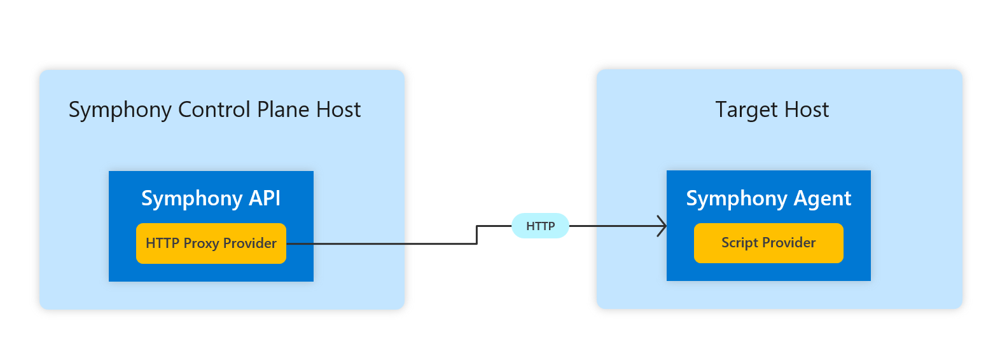

# Remote agent deployment scenario

This scenario illustrates the deployment of solution components in a remote target machine, which is connected to the Symphony control plane over HTTP(S).



In this scenario, you will:

* Set up a Symphony control plane (running on Linux) and another Linux target machine.
* Submit a target definition to the Symphony control plane using its REST API. The Target specifies that a set of shell commands should be executed in the target machine. This desired state is forwarded to the target machine over HTTP(S). 
* Configure a script provider on the target machine to perform the state seeking operations to ensure that the shell commands are executed.
* Explore 2 options to deploy a Solution:
   * Using an Instance for an immediate reconciliation (Solution, Target, Instance).
   * Using a Campaign for a deffered reconciliation (Campaign, Activation).

We use a catalog object instead of an instance object here because an instance object represents a desired state, which will trigger Symphony state reconciliation. In this case, however, we don’t want the state reconciliation to be triggered before approval. Hence, we capture the “intention of the desired state” in a catalog object. The intention will be “materialized” into an instance object only after approval.

Although this scenario is designed for a distributed environment, for simplicity we'll set up everything on a single machine.

## 1. Prepare a Linux target machine

1. Let's assume that you have the content of this repo inside a folder named `/home/rfp/demo` on your Linux machine.

2. Build the `symphony-api`:

   ```bash
   # under the api folder of the repository
   go build -o symphony-api
   ```

3. Copy `symphony-api` to the `/home/rfp/demo` folder. The Symphony agent and Symphony API share the same binary, driven by different configuration files, which you'll copy next. If you prefer you can also copy `symphony-api` to a new file `symphony-agent`. 

4. Use the provided `symphony-agent.json` file that should reside in the `/home/rfp/demo` folder. This is the configuration file that you'll use to launch the Symphony agent.

5. Use the provided `symphony-api-no-k8s.json` file that should reside in the `/home/rfp/demo` folder. This is the configuration file that you'll use to launch the Symphony API.

6. The scripts folder `script-provider` inside the `/home/rfp/demo` folder contains the scripts that will be used by the script provider to perform state seeking on the target Linux machine.

7. You should have this final structure of files and folders in the `/home/rfp/demo` folder:

    * README.md
    * docs
    * local-campaign
    * remote-campaign
    * remote-target
    * s01-start-symphony-api.sh
    * s02-start-symphony-agent.sh
    * script-provider
    * symphony-agent
    * symphony-agent.json
    * symphony-api
    * symphony-api-no-k8s.json


## 2. Launch the Symphony API

In this demo scenario, we'll run Symphony API in standalone mode outside of Kubernetes.

1. In a Linux Shell terminal, navigate to `/home/rfp/demo`.
2. Launch Symphony API:

   ```bash
   ./s01-start-symphony-api.sh
   ```

## 3. Launch the Symphony Agent

Also under the `/home/rfp/demo` folder, launch the Symphony agent:

```bash
./s02-start-symphony-agent.sh
```

## 4. Options for deployment

Explore one or both options to deploy your solution in the remote target:
   * Using an [Instance](docs/instance-option.md) for an immediate reconciliation (Solution, Target, Instance).
   * Using a [Campaign](docs/campaign-option.md) for a deffered reconciliation (Campaign, Activation).

## 5. Shut down

To stop the demo, shut down both the API process and the agent process. By default, they are both configured to use in-memory state, so no additional cleanup is needed. To repeat the demo, relaunch the processes and re-send the requests.


## Notes

Check the list of [notes](docs/notes.md) that might be helpful in some cases.
