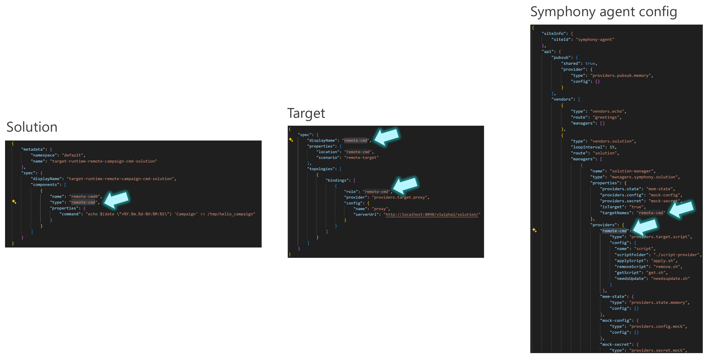

# Troubleshooting and notes

- [Target name, role name and provider name](#target-name-role-name-and-provider-name)
- [Target selectors](#target-selectors)
- [Issues with jq json filtering](#issues-with-jq-json-filtering)


## Target name, role name and provider name

The name of the Target must match the name of the binding role, and the name of the binding role needs to match the name of the provider in the Symphony agent configuration. In the same way, the Solution component type needs to match the name of the binding role. The picture below illustrates these matches.




## Target selectors

When we define a Target we can define properties that can be used to filter the targets that will be selected by the Solution. In the example below, the target properties `location` and `scenario` are defined:

```json
{
    "spec": {
        "displayName": "remote-cmd",
        "properties": {
            "location": "remote-cmd",
            "scenario": "demo"
        },
        "topologies": [
            {
                "bindings": [
                    {
                        "role": "remote-cmd",
                        "provider": "providers.target.proxy",
                        "config": {
                            "name": "proxy",
                            "serverUrl": "http://localhost:8098/v1alpha2/solution/"
                        }
                    }
                ]
            }
        ]
    }
}
```

We can create an Instance of a Solution directly on this Target. This would be the Instance snippet for it where we reference the target by its name:

```json
...
    "solution": "demo-solution",
    "target": {
        "name": "remote-cmd"
    }
...
```

Or we can use a selector to reference the target. In this case, the selector is based on the `scenario` property:

```json
...
    "solution": "demo-solution",
    "target": {
        "selector": {
            "scenario": "demo"
        }
    },
...
```

## Issues with jq json filtering

If you encounter problems like `P (Script Target): failed to parse get script output ... unexpected end of JSON input ...` it might be related with `jq` issues.


The script provider on the target machine uses several shell scripts that rely on the `jq` (JSON processor) utility. When using Ubuntu OS in the target machine, some strange behaviors where detected when `jq` is installed using the `snap` package manager. This is reported in [Stack Overflow](https://stackoverflow.com/questions/58128001/could-not-open-file-lol-json-permission-denied-using-jq). To overcome the problem, the suggestion is to install `jq` from the official website (they have a static binary) or with `apt` (older version but works).

1. Problem description

When using `jq` to filter the json output you might jump into `jq: error: Could not open file xxxx.json: Permission denied` error. Think of an example with file `test.json`:

```bash
$ cat test.json
[
 {
  "action": "update",
  "component": {
   "name": "remote-cmd0",
   "type": "remote-cmd",
   "properties": {
    "command": "echo $(date \"+%Y.%m.%d-%H:%M:%S\") 'Campaign' \u003e\u003e /tmp/hello_campaign"
   }
  }
 }
]
```

By checking the file permissions, everything looks fine:

```bash
$ ls -la
drwxrwxr-x 2 demouser demouser 4096 Jun  6 18:48 .
drwxrwxr-x 7 demouser demouser 4096 Jun  6 18:46 ..
-rw-r--r-- 1 demouser demouser  224 Jun  6 18:48 test.json
```

But if you try to filter the json output with `jq` you might get an error:

```bash
$ jq -r '[.[] | .component]' test.json

jq: error: Could not open file test.json: Permission denied
```

This is related with how `jq` was installed. In this case, `jq` was installed using `snap`:

```bash
sudo snap install jq
```

2. How to fix it

To fix the problem, you can install `jq` from the official website. You can download the static binary from [here](https://jqlang.github.io/jq/). For example, to install `jq` in a Linux machine:

```bash
wget https://github.com/jqlang/jq/releases/download/jq-1.7.1/jq-linux-amd64
chmod +x jq-linux-amd64
```

Then you can use the `jq-linux-amd64` binary to filter the json output and check that it works fine:

```bash
./jq-linux-amd64 -r '[.[] | .component]' test.json

[
  {
    "name": "remote-cmd0",
    "type": "remote-cmd",
    "properties": {
      "command": "echo $(date \"+%Y.%m.%d-%H:%M:%S\") 'Campaign' >> /tmp/hello_campaign"
    }
  }
]
```

At this stage you can uninstall the `jq` snap package:

```bash	
sudo snap remove jq

And move the `jq-linux-amd64` binary to `/usr/local/bin` to make it available in the path:

```bash
sudo mv jq-linux-amd64 /usr/local/bin/jq
```

Now you can restart or create a new bash terminal or clean the cache with `hash -r` to refresh the path to `jq`:

```bash
hash -d jq
```

You are now running `jq` from the official website and the problem should be fixed.
